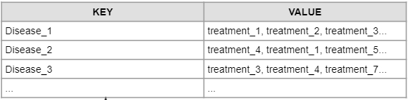

# Syntactic Processing
> In this Assignment , we will apply the knowledge learned about NLP, specifically NER and CRF, to search and analyze the name of the disease and its treatment method according to the provided data.

## Table of Contents
1. [General Info](#general-information)
2. [Technologies Used](#technologies-used)
3. [Approach Method](#approach-method)
4. [Conclusions](#conclusions)
5. [Acknowledgements](#acknowledgements)

<!-- You can include any other section that is pertinent to your problem -->

## General Information
- ‘BeHealthy’ has a web platform that allows doctors to list their services and manage patient interactions and provides services for patients such as booking interactions with doctors and ordering medicines online. Here, doctors can easily organise appointments, track past medical records and provide e-prescriptions.
 
- Example sentences below: __“The patient was a 62-year-old man with squamous cell lung cancer, which was first successfully treated by a combination of radiation therapy and chemotherapy.”__  Suppose you have been given such a data set in which a lot of text is written related to the medical domain. As you can see in the dataset, there are a lot of diseases that can be mentioned in the entire dataset and their related treatments are also mentioned implicitly in the text, which you saw in the aforementioned example that the disease mentioned is cancer and its treatment can be identified as chemotherapy using the sentence.

- Disease analysis and disease name can be based on the form below.
    

- Dataset: __Provided by the Upgrad educational institution__. You can consult and download from this repo.
- We don't have any more interpretive information about data. You can refer to the code in the __Jupyter Notebook__ file to understand how to handle it

## Technologies Used
* In this project we use some of the following libraries, you can install it according to the version noted in the requirement.txt file.
> Pandas version 	 1.4.2
Numpy version 	 1.22.3
Ploly version 	 5.6.0
Matplotlib version 	 3.5.1
Seaborn version 	 0.11.2

## Expected Tasks
- Our approach is as follows:
>1. Data preprocessing
>2. Concept identification
>3. Defining the features for CRF
>4. Getting the features words and sentences
>5. Defining input and target variables
>6. Building the model
>7. Evaluating the model
>8. Identifying the diseases and predicted treatment using a custom NER

## Conclusions
- Debt Consolidation Purpose Tops across all default loans
- Small Business / Renewable energy / Educational / Other / Moving Purpose are top defaults loans
- On an average risky loans are charged 2 % higher interest rates
- 42 % Default loan are from 60 months term compared to all default loans
- Grade A is most reliable group
- Grade F & G are more riskier group
- Close to 3% increase in loan default with applicant experience more than 9
- Mortgage Home Ownership loan are least riskier than all others home ownership loans
- Risk Order for home Ownership is Mortgage < OWN < Rent < Others

## Acknowledgements
- This project was inspired by our group exercise on loan market analysis.
- References on [Reference_1](https://www.kaggle.com/code/bavalpreet26/ner-using-crf).  [Reference_2](https://www.dominodatalab.com/blog/named-entity-recognition-ner-challenges-and-model).

## Contact

Created by : Pham Van Thai: phamthai.ats@gmail.com Feel free to contact us!
- We do not have any constraints about License on the use of our results. You can use it for free.
